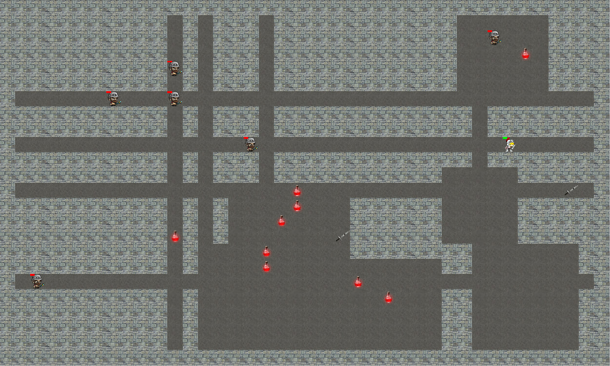

# Roguelike game on pure JS

<ul>
  <li>Сгенерировать карту 40×24</li>
  <li>Залить всю карту стеной</li>
  <li>Разместить случайное количество (5–10) прямоугольных «комнат» со случайными размерами (3–8 клеток в длину и ширину)</li>
  <li>Разместить случайное количество (3–5 по каждому направлению) вертикальных и горизонтальных проходов шириной в 1 клетку</li>
  <li>Разместить мечи (2 шт) и зелья здоровья (10 шт) в пустых местах</li>
  <li>Поместить героя в случайное пустое место</li>
  <li>Поместить 10 противников в случайные пустые места</li>
  <li>Сделать возможность передвижения героя клавишами WASD (влево-вверх-вниз-вправо)</li>
  <li>Сделать возможность атаки клавишей пробел всех противников, находящихся на соседних клетках</li>
  <li>Сделать атаку героя противником, если герой находится на соседней клетке с противником</li>
  <li>Сделать случайное передвижение противников (на выбор: либо передвижение по одной случайной оси, либо случайное направление каждый ход, либо поиск и атака героя)</li>
  <li>Сделать восстановление здоровья при наступлении героя на зелье здоровья (и удаление зелья)</li>
  <li>Сделать увеличение силы удара героя при наступлении героя на меч (и удаление меча)</li>
  <li>Должно запускаться открытием файла index.html в браузере (без сервера) (не обязательно должен быть только файл index.html, скрипты можно разбивать на файлы)</li>
  <li>Не должно быть недостижимых зон</li>
</ul>

